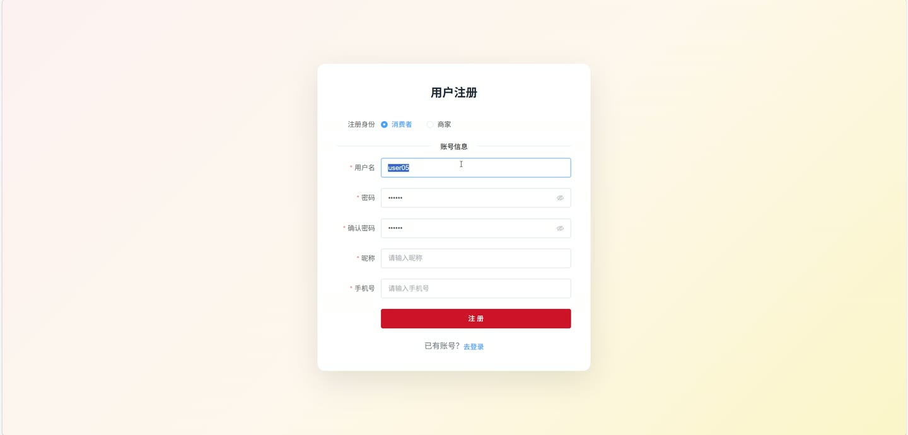
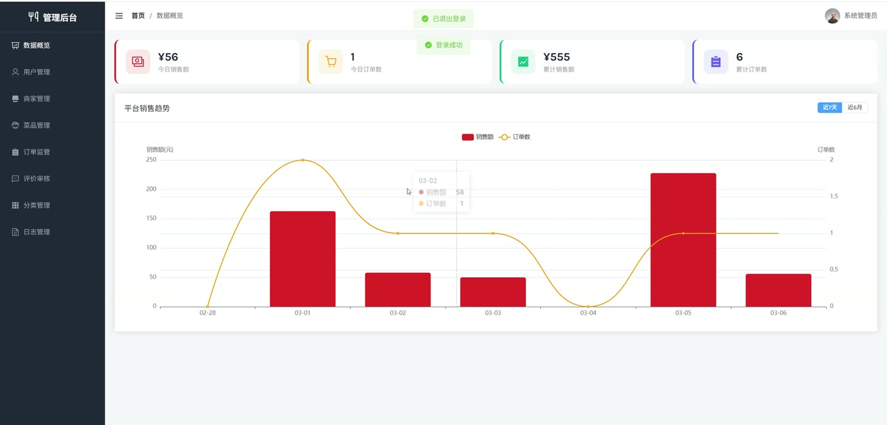
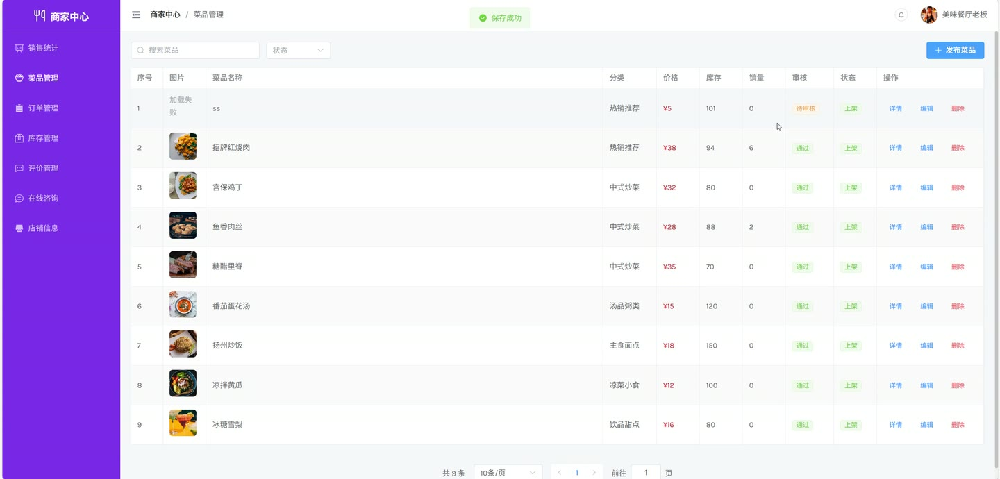

# (附文档)Springboot3+Vue3+MySQL 在线订餐系统

**技术栈**：Springboot3、Vue3、MySQL

### 系统简介

本系统是一套基于 SpringBoot3 + Vue3 前后端分离架构的在线订餐平台，支持普通用户在线浏览菜品、加购下单、在线咨询，商家端管理菜品、处理订单、回复评价，管理员端审核商家与菜品、管理用户与订单，覆盖完整的订餐业务链路。
 
### 核心功能
 
### 普通用户端

 
- 注册账号（填写用户名/密码/手机号/邮箱） 
- 登录账号（用户名+密码，返回 JWT Token） 
- 浏览菜品列表（支持按关键词搜索、按分类筛选、按商家筛选、价格区间筛选、按销量/价格排序） 
- 查看菜品详情（展示菜品信息、所属商家、分类、评价列表） 
- 管理收货地址（新增/修改/删除地址，设置默认地址，地址含省/市/区/详细地址/收件人/电话） 
- 管理购物车（添加菜品到购物车、修改数量、删除单条、批量删除、清空购物车） 
- 提交订单（从购物车选择商品下单，选择收货地址，填写备注） 
- 立即购买（不经过购物车，直接选择菜品数量下单） 
- 模拟支付（将待支付订单状态改为已支付） 
- 取消订单（仅待支付/已支付状态可取消，自动恢复菜品库存） 
- 申请退款（已支付/已接单状态可申请退款，填写退款原因） 
- 确认收货（配送中状态可确认收货，订单变为已完成） 
- 查看订单列表（分页展示，支持按订单状态筛选） 
- 查看订单详情（展示订单号、金额、状态、地址、商品明细） 
- 收藏菜品（添加/取消收藏，查看收藏列表，检查是否已收藏） 
- 发表评价（对已完成的订单菜品发表评分和文字评价） 
- 在线咨询（与商家发送消息，查看聊天记录，查看会话列表，标记消息已读） 
- 查看未读消息数（首页显示未读咨询消息数量） 
- 修改个人信息（修改昵称、头像、手机号、邮箱） 
- 修改密码（输入旧密码和新密码） 
- 商家入驻申请（填写店铺名称、店铺Logo、地址、电话、营业执照，提交后待审核） 
- 查看入驻申请状态（查询当前审核进度） 
- 重新提交入驻申请（审核被拒绝后可修改信息重新提交）
 
### 商家端

 
- 发布菜品（填写菜品名称、图片、分类、价格、库存、库存预警阈值、规格，提交后待审核） 
- 修改菜品信息（编辑已发布的菜品属性） 
- 删除菜品（下架并删除菜品） 
- 管理菜品列表（分页查看自己发布的菜品，支持按关键词和状态筛选） 
- 更新菜品库存（手动修改库存数量） 
- 查看库存预警列表（自动筛选库存 ≤ 预警阈值的菜品） 
- 查看订单列表（分页展示本店订单，支持按状态筛选） 
- 接单（将已支付订单状态改为已接单） 
- 发货（将已接单订单状态改为配送中） 
- 处理退款（查看退款申请，同意退款/拒绝退款，同意后自动恢复库存） 
- 查看销售统计（按日统计近7天销售额和订单数，按月统计近6个月数据，含热销菜品排行） 
- 回复评价（对用户发表的评价进行回复） 
- 查看评价列表（查看本店所有评价） 
- 在线咨询（查看用户会话列表，发送/接收消息，标记已读） 
- 修改店铺信息（修改店铺名称、Logo、地址、电话）
 
### 管理员端

 
- 管理用户列表（分页查询所有用户，支持按关键词/角色/状态筛选） 
- 修改用户状态（启用/禁用用户账号） 
- 删除用户 
- 管理商家列表（分页查询入驻商家，支持按关键词/审核状态筛选） 
- 审核商家入驻（通过/拒绝，填写审核备注，通过后自动将用户角色升级为商家） 
- 管理菜品列表（分页查看所有菜品，支持按关键词/审核状态/分类筛选） 
- 审核菜品（通过/拒绝菜品上架申请，填写审核备注） 
- 管理订单列表（分页查看全平台订单，支持按状态/订单号搜索） 
- 查看平台销售统计（按日/按月统计全平台销售额、订单数、热销菜品） 
- 管理评价列表（分页查看所有评价，支持按状态筛选） 
- 审核评价（通过/隐藏用户评价） 
- 删除评价 
- 管理分类（新增/修改/删除菜品分类，分类名称唯一，删除时检查是否有关联菜品） 
- 查看操作日志（分页查看所有用户操作记录，支持按关键词/模块筛选） 
- 清空操作日志 
- 删除单条操作日志
 
### 技术栈

 后端框架Spring Boot 3.x ORMMyBatis-Plus 权限认证JWT Token 拦截器 前端框架Vue 3 状态管理Pinia 构建工具Vite 数据库MySQL UI 组件库Element Plus HTTP 客户端Axios
 
### 交付内容

 
- 后端完整源码 
- 前端完整源码 
- 数据库初始化脚本 
- 万字文档

## 界面展示

---

## 获取完整源码 + 万字文档

本仓库为项目介绍页。**完整前后端源码、数据库初始化脚本、万字项目文档**，请加微信 `kangkangcode`，或访问 [codekk.top](http://codekk.top) 获取。

可作课程设计 / 毕业设计参考，支持远程部署调试。